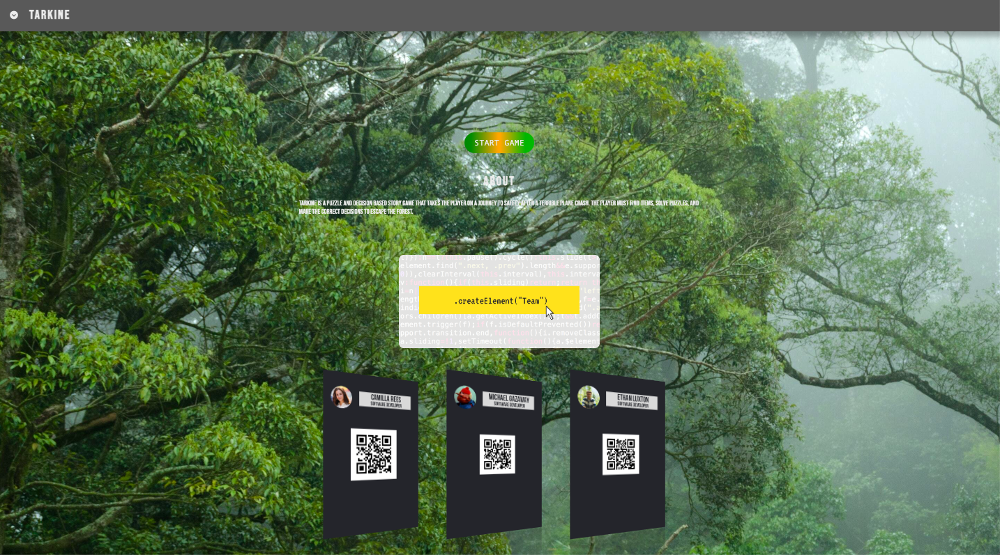
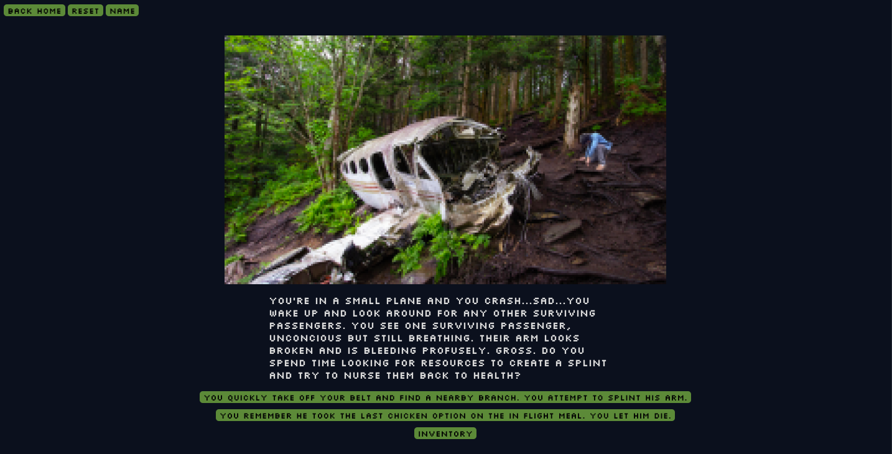

Camilla Rees. Ethan Luxton, Michael Gazaway

## 1. [Wireframe](https://www.figma.com/file/enThDnqGkBlOgcD2RFlRXS/Wireframe)
## 2. [Domain Model](https://www.figma.com/file/kZXrwVereQ6oRuRyCX7HvE/Domain-Model)
## 3. [Deployed Game]()

## Project Domain
Who doesn’t love a choose your own adventure game?!
Tarkine offers entertainment and interesting, solvable challenges to users.

### MVP: 
Functioning game using events, constructors, DOM manipulation, forms and local storage. These elements are used to build diverging story branches for user to choose from, and includes puzzle elements for user to make progress and a win condition.

## Overview
Tarkine (an ancient forest of Tasmania) is a game built in HTML, CSS and JavaScript where the player finds themself trapped in a forest. Through the player’s own decisions and exploration they face a dynamic storyline that requires problem solving, deduction, and resource gathering in order to escape.

## Key Features
- Custom graphics and styling
- Inventory system based on local storage
- Decision-based progression
- Win/loss condition

